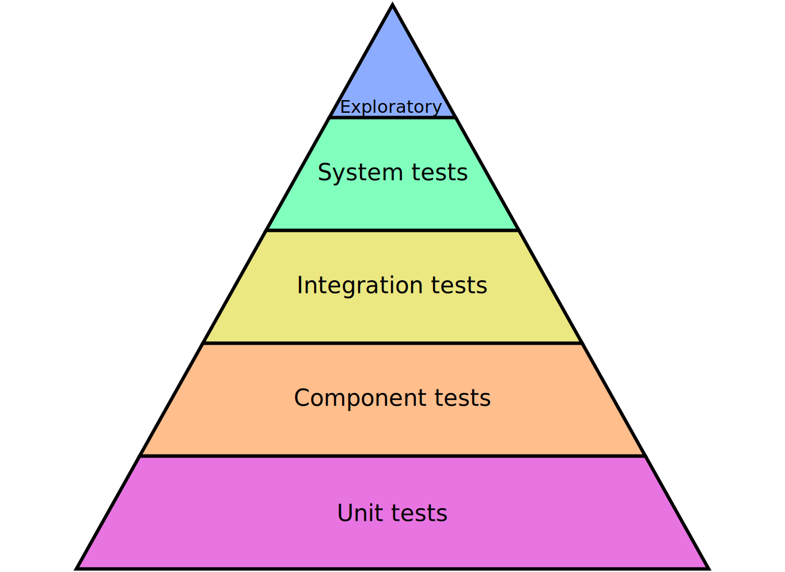

<section>

# Software testing overview
— with [mparker17][mparker17-drupalorg]

<small>Follow along at [mparker17.github.io/talk--software-testing-overview](index.md)</small>

[mparker17-drupalorg]: https://www.drupal.org/u/mparker17

</section>

<section>
<section>

## Who am I?

[mparker17][mparker17-drupalorg] on Drupal.org, [Github][mparker17-github], and [Gitlab][mparker17-gitlab]

I work for [Digital Echidna][echidna], [Brady's Meat & Deli][bradysmeats]

<small>(previously [Environment Canada][wsc], [Versabanq][versabanq], [UWaterloo][uwaterloo], [PeaceWorks][peaceworks], [Myplanet][myplanet], [OpenConcept][openconcept])</small>

I am an [Acquia Certified Drupal Developer][acquia-cert]

<small><abbr title="Computer Science">CS</abbr> degree not completed at UWaterloo</small>

[mparker17-github]: https://github.com/mparker17
[mparker17-gitlab]: https://gitlab.com/mparker17
[echidna]: https://echidna.ca
[bradysmeats]: https://bradysmeats.com
[wsc]: https://www.canada.ca/en/environment-climate-change/services/water-overview/quantity/monitoring/survey.html
[versabanq]: https://www.versabank.com
[uwaterloo]: https://uwaterloo.ca
[peaceworks]: https://peaceworks.ca
[myplanet]: https://www.myplanet.com
[openconcept]: https://openconcept.ca
[acquia-cert]: https://certification.acquia.com/user/843258

</section>
</section>

<section>
<section>

## Dictionary definitions

**Testing (verb)**

To evaluate1 [a system for correctness]

**A test (noun)**

A procedure leading to acceptance or rejection1 [of a system's correctness]

**But keep in mind...**

"Testing only shows the presence, not the absence, of bugs" — Edsger W. Dykstra2

</section>
<section>

# Why test?

* Our customers and employers pay for software that works correctly.
* Tests give us confidence that our system works correctly.

</section>
<section>

# Tests tell us that...

* our system does what it is intended to do,
* changes have not broken existing functionality,
* our system can handle edge-cases.

</section>
</section>

<section>
<section>

## Varieties of software testing

1. Manual tests (get a person to test)
2. Automated tests (get the computer to test itself)

 

We want to automate as many tests as possible to save time and money, but it's not possible / practical to automate _everything_.

</section>
<section>

## Types of software testing

1. Exploratory tests
2. System tests
3. Integration tests
4. Component tests
5. Unit tests

</section>
<section>

</section>
<section>

Unit ▸ Component ▸ Integration ▸ System ▸ Exploratory

In an ideal world...

| Unit tests         | Exploratory tests      |
| ------------------ | ---------------------- |
| have Small scope   | have Large scope       |
| are Fast to run    | are Slow to run        |
| are Cheap to write | are Expensive to write |
| are Numerous       | are Sparse in number   |

</section>
<section>

**Unit** ▸ Component ▸ Integration ▸ System ▸ Exploratory

* **What?** White-box tests to cover edge cases, code branches
* **Covers?** Code paths, individual components (functions)
* **How?** Test parameters, pre/post conditions, state changes, output. Mock dependencies.
* **Who writes?** Developer
* **When?** *Ideally* Before function code; *Last chance* Before commit
* **Key tech:** xUnit, mock objects (PHPUnit, RSpec, QUnit, Jasmine, Unit.js, Hamcrest)

</section>
<section>

Unit ▸ **Component** ▸ Integration ▸ System ▸ Exploratory

* **What?** Grey-box tests to cover interactions between objects/interfaces
* **Covers?** Success/failure states, component interactions.
* **How?** Test subsystem inputs/outputs. Mock dependencies, shared resources, and IPC
* **Who writes?** Developer
* **When?** *Ideally* Before object code; *Last chance* Before merging feature-branch (while building).
* **Key tech:** xUnit, mock objects

</section>
<section>

Unit ▸ Component ▸ **Integration** ▸ System ▸ Exploratory

* **What?** Black-box tests to cover user paths through the system
* **Covers?** Functions correctly, can complete tasks, meets client's requirements
* **How?** Look at user story/ticket, write steps to complete
* **Who writes?** PO/Client/Tester/Developer
* **When?** *Ideally* Before UI; *Last chance* Before merging feature branch
* **Key tech:** Gherkin, SimpleTest, manual tests (Quail, Behat, Selenium; a11y/browser tests)

</section>
<section>

Unit ▸ Component ▸ Integration ▸ **System** ▸ Exploratory

* **What?** Black-box tests to cover the system as a whole and catch regressions
* **Covers?** The system as a whole
* **How?** Regression, performance, load/stress/volume, compatibility, recovery tests
* **Who writes?** Tester/Developer/PO
* **When?** After integrating code, before demo
* **Key tech:** Continuous integration tools, manual tests (New Relic)

</section>
<section>

Unit ▸ Component ▸ Integration ▸ System ▸ **Exploratory**

* **What?** Black-box tests to determine if the proposed UI is useful, usable, aesthetic, identifiable,
inspirational and valuable
* **Covers?** End-user experience
* **How?** Present design to users, gather data on how they experience it
* **Who writes?** Designer/UX expert
* **When?** *Ideally* After 1st design proposal; *Last chance* Before finalizing design, after release
* **Key tech:** Visual diff tools, A/B testing frameworks, observation (Quail, Acquia Lift, PhantomJS, Selenium)

</section>
</section>

